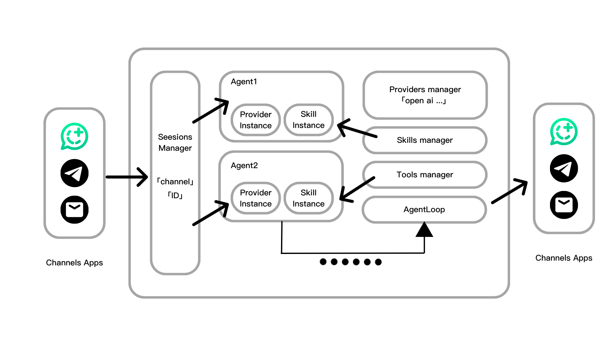

# Aurogen: More OpenClaws

<div align="right">
  <strong>English</strong> | <a href="docs/README.cn.md">简体中文</a>
</div>

> **A note from the developer:** The open-source community already has many OpenClaw alternatives — some rewritten in faster languages, others easier to deploy — but most come with trade-offs: reduced features or a steeper barrier for secondary development. As heavy AI users who have tried most of the alternatives, we identified real pain points and built Aurogen as a complete reimplementation of the OpenClaw paradigm with the following characteristics.

## ✨ Features

**🗂️ Fully Modular** — Aurogen completely modularizes, instantiates, and parallelizes every OpenClaw concept — **Agents, Channels, Providers, Skills, and more** — so you can compose and orchestrate them however you like. In Aurogen, a single deployment can run **many lobsters at once**, which is exactly what *More OpenClaws* means.

**💡 Easy Configuration** — Aurogen ditches CLI interaction and config files entirely. After installation, just open the web panel → set a password → configure your first Provider, and you're ready to go in the Web Channel. All modules are loaded dynamically, so every setting takes effect immediately — **no restart required**.

**🦀 Ecosystem Compatible** — Aurogen is fully compatible with the OpenClaw ecosystem. You can download any skill from [clawhub.ai](https://clawhub.ai/) and import it directly into Aurogen. The built-in public skills also include native ClaWHub integration.

> **Etymology:** *Aurogen* = *Aurora* (dawn / aurora borealis, the Roman goddess of dawn) + *generation*. The pronunciation kind of sounds like an orange 🍊 — so come grow an orange tree full of 🍊!

---

## 📢 News

- **2026-03-10** — **Aurogen is live! Come taste an 🍊!**

---

## 🏗️ Architecture



> *Diagram is a rough draft — a cleaner version is coming soon.*

---

## 🦀 Feature Comparison

| Feature | Aurogen | OpenClaw | NanoBot | PicoClaw | ZeroClaw |
|---|:---:|:---:|:---:|:---:|:---:|
| Memory | ✅ | ✅ | ✅ | ✅ | ✅ |
| Tools / Skills | ✅ | ✅ | ✅ | ✅ | ✅ |
| Sub-agents | ✅ | ✅ | ✅ | ✅ | ✅ |
| Web panel | ✅ | ✅ | ✖️ | ✖️ | ✖️ |
| Multi-agent (non-subagent) | ✅ | ✖️ | ✖️ | ✖️ | ✖️ |
| Multi-instance per channel | ✅ | ✖️ | ✖️ | ✖️ | ✖️ |
| BOOTSTRAP mechanism | ✅ | ✅ | ✖️ | ✖️ | ✖️ |
| **Minimum hardware cost** | Linux SBC ~$50 | Mac Mini $599 | Linux SBC ~$50 | Linux Board $10 | Any hardware ~$10 |

> NanoBot has partial multi-instance support, but configuration is a bit involved.
>
> These are all excellent projects that inspired Aurogen greatly. They are actively maintained, so this table may become outdated quickly.

More unique features will be documented as the project evolves.

---

## 🚀 Quick Start

### One-click Installer

> Coming soon!

### Docker

Build the image:

```bash
docker build -t aurogen .
```

Run Aurogen with a persistent workspace:

```bash
docker run --rm -p 8000:8000 \
  -v "$(pwd)/aurogen/.workspace:/app/aurogen/.workspace" \
  aurogen
```

Then visit `http://localhost:8000`.

### Docker Compose

From the project root directory:

```bash
docker compose up -d --build
```

### Development Setup

**Prerequisites:** [conda](https://docs.conda.io/) (or another Python environment manager) and [Node.js](https://nodejs.org/).

From the project root directory:

**1. Start the backend:**

```bash
# Create the environment
conda create -n aurogen python=3.12

# Install dependencies
conda activate aurogen && cd ./aurogen && pip install -r requirements.txt

# Start the server
uvicorn app.app:app --host 0.0.0.0 --port 8000 --reload
```

**2. Start the frontend:**

```bash
cd ./aurogen_web && npm i
npm run dev
```

### First Steps: Set Password and Provider

After deployment, open the web panel and follow the setup wizard to configure your password and first Provider.
