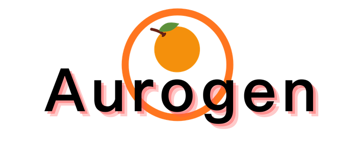
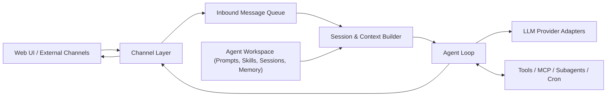

  
  <h2>Aurogen: The Multi-Agent Evolution of OpenClaw.</h1>

Language: **English** | [中文](./docs/README.zh-CN.md)

Aurogen turns the OpenClaw idea into a modular multi-agent runtime with isolated workspaces, a web-first control plane, and a reusable skill ecosystem.

### 🚀 Key Features

**1. Modular Multi-Agent Runtime with Isolated Workspaces**
Aurogen routes messages from Web UI and external channels into one unified agent loop while keeping each agent isolated by workspace, prompts, sessions, skills, and memory.
*   **Runtime isolation:** Each conversation resolves `channel -> agent -> workspace`, so different channels can be bound to different agents without mixing context.
*   **Composable execution:** Sessions build agent-specific context, the agent loop calls the selected provider and tools, and the final response is routed back through the original channel.

**2. Zero-CLI: 100% Web-Based Orchestration**
Instead of relying on a CLI-first onboarding flow, Aurogen exposes configuration and operations through a web interface.
*   **Web-first management:** Providers, channels, agents, MCP servers, and scheduled jobs can be configured from the UI.
*   **Lower setup friction:** Users do not need to memorize terminal commands to get from installation to a working agent deployment.

**3. Seamless Ecosystem Integration**
While the runtime is refactored for better isolation and operability, Aurogen keeps the ecosystem benefits that made OpenClaw attractive.
*   **Skill reuse:** Built-in skills, ClawHub-style skill distribution, web automation, Cron, and MCP-based extensions remain first-class capabilities.
*   **More predictable operations:** The modular pipeline makes it easier to trace how a task moved through channels, sessions, tools, and providers.