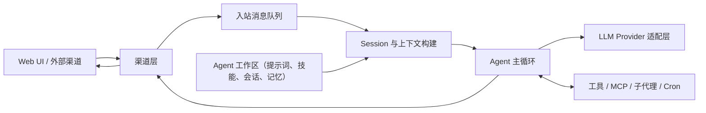

  
  <h2>Aurogen：OpenClaw 的多 Agent 演进形态</h2>

语言： [English](../README.md) | **中文**

Aurogen 将 OpenClaw 的思路扩展为一个更模块化的多 Agent 运行时，强调隔离工作区、Web 优先控制面板，以及可复用的技能生态。

### 关键特性

**1. 带隔离工作区的模块化多 Agent 运行时**
Aurogen 会把来自 Web UI 和外部聊天渠道的消息汇入统一的 Agent 主循环，同时通过工作区、提示词、会话、技能和记忆，将不同 Agent 的上下文彼此隔离。
*   **按运行时隔离：** 每次对话都会沿着 `channel -> agent -> workspace` 解析，因此不同渠道可以绑定到不同 Agent，而不会共享上下文。
*   **按流水线组合：** Session 会构建 Agent 专属上下文，AgentLoop 调用对应的模型提供方与工具，再把最终结果回传给原始渠道。

**2. 零 CLI、Web 优先的编排体验**
Aurogen 不再把初始化和日常运维建立在命令行流程之上，而是把主要配置与操作能力集中到 Web 界面。
*   **Web 优先管理：** Provider、渠道、Agent、MCP Server 与定时任务都可以从界面配置。
*   **更低的上手门槛：** 用户无需记忆一组终端命令，便能从安装走到可用的 Agent 部署。

**3. 无缝继承并扩展生态能力**
在重构底层运行时、提升隔离性和可运维性的同时，Aurogen 依然保留了 OpenClaw 生态中最有价值的能力。
*   **技能生态复用：** 内置技能、ClawHub 风格技能分发、Web 自动化、Cron 与基于 MCP 的扩展能力依旧是一等公民。
*   **更可预测的执行路径：** 模块化链路让你更容易追踪一次任务如何经过渠道、会话、工具和模型提供方。

### 继续阅读

- 查看英文首页与完整文档：[README](../README.md)
